<picture>
  <source media="(prefers-color-scheme: dark)" srcset="img/logo_grey.png">
  <source media="(prefers-color-scheme: light)" srcset="img/logo_blue.png">
  
</picture>

# Setting up SSO with Microsoft Entra ID

When you're using [Microsoft Entra ID](https://www.microsoft.com/en-us/security/business/identity-access/microsoft-entra-id)
(formerly Azure Active Directory) as an Identity Provider, the following steps must be followed to connect the Blue
Billywig SSO to Entra ID.

## Create new application

* Log in to the [Microsoft Azure Portal](https://portal.azure.com/) and navigate to **Microsoft Entra ID**.
* Click on **Add** -> **Enterprise application**.

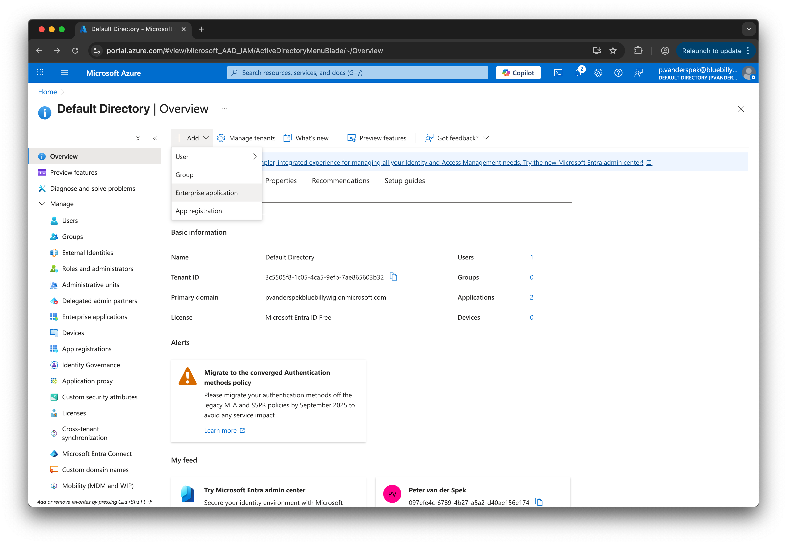

* Click on **Create your own application**.

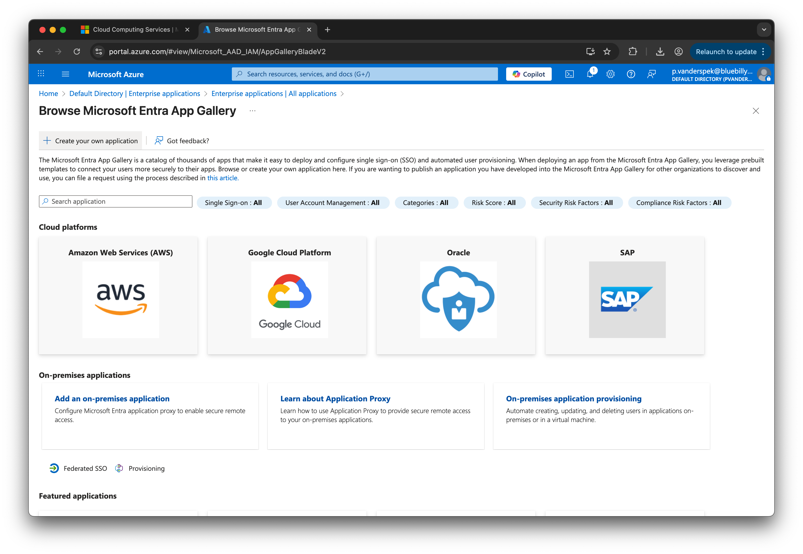

### Create new application - Basic information

* In **Create your own application**:
* Enter the **App name**, for example: `Blue Billywig`.
* Select **Integrate any other application you don't find in the gallery (Non-gallery)**.
* Click **Create**.

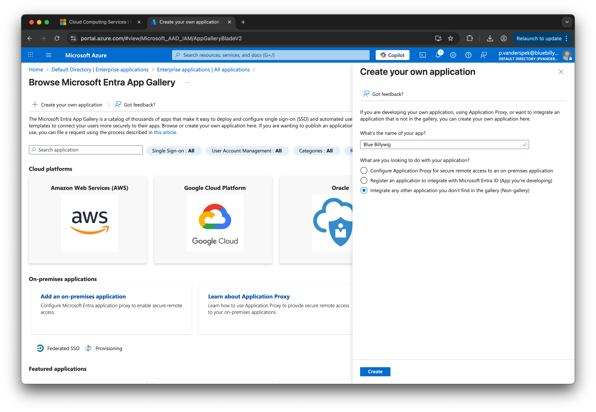

### Configure Single Sign-On

The new application has been created in Entra ID.
* Click on **Set up single sign on**.

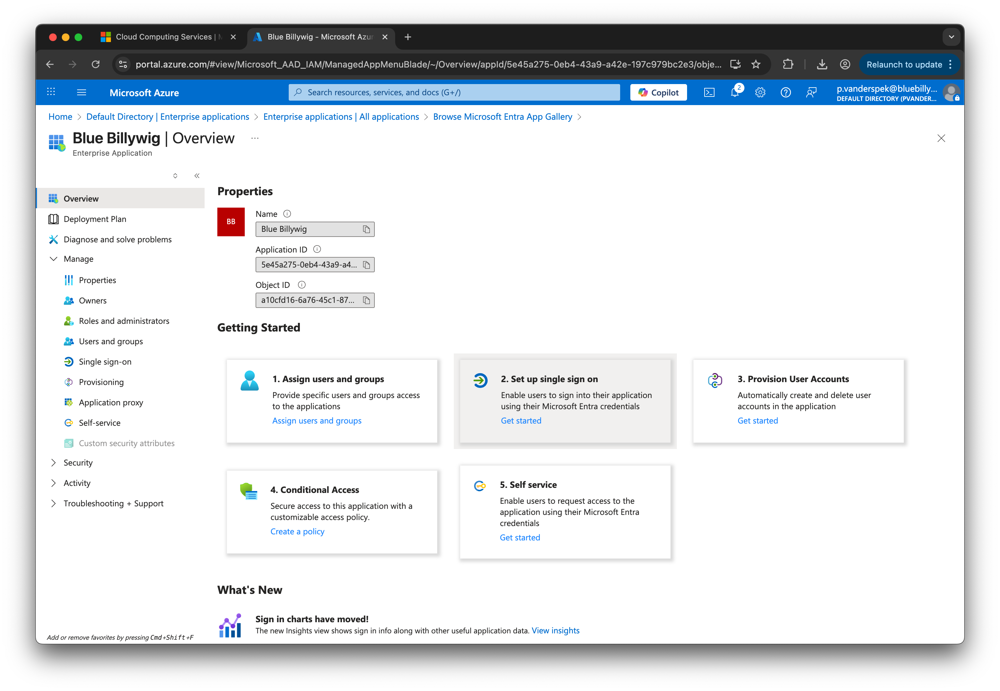

* Click on **SAML** as the single sign-on method.

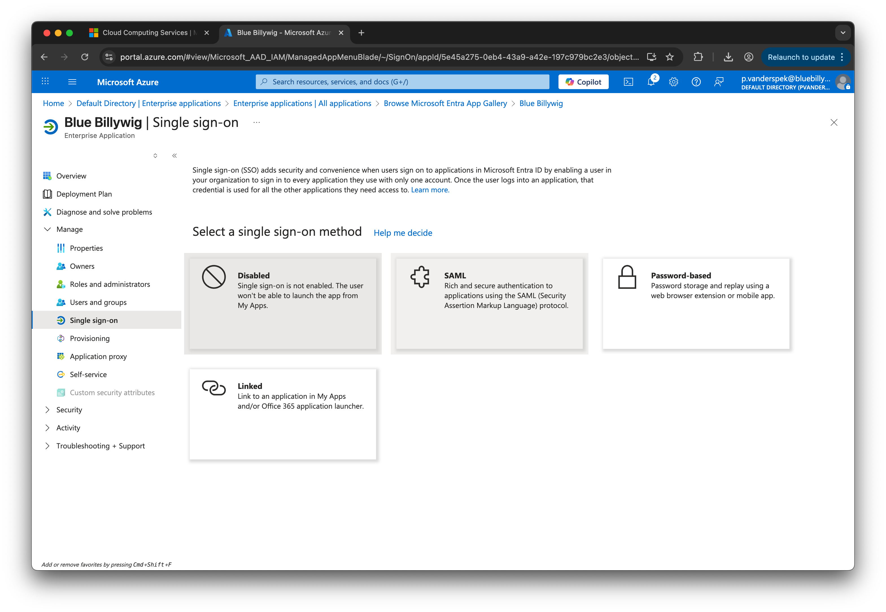

SAML has now been selected as the single sign-on method.

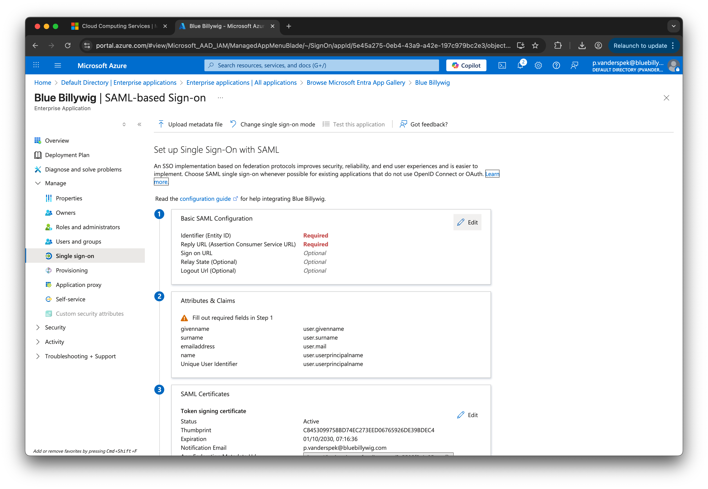

### Basic SAML Configuration

* Click **Edit** in the **Basic SAML Configuration** section.
* Enter **Identifier (Entity ID)**: `urn:amazon:cognito:sp:eu-west-1_2Gn0U5Y6I`
* Enter **Reply URL (Assertion Consumer Service URL)**: `https://auth.bluebillywig.com/saml2/idpresponse`
* Leave **Sign on URL** empty.
* Leave **Relay State (Optional)** empty.
* Enter **Logout Url (Optional)**: `https://auth.bluebillywig.com/saml2/logout`

> [!NOTE]
> The above **Identifier (Entity ID)**, **Reply URL**, and **Logout Url** are for connecting to the Blue Billywig 
> production environment. When you need to connect to the Blue Billywig test environment, use the following settings
> instead:
> 
> * **Identifier (Entity ID)**: `urn:amazon:cognito:sp:eu-west-1_nPGHGV8P3`
> * **Reply URL (Assertion Consumer Service URL)**: `https://test.auth.bluebillywig.com/saml2/idresponse`
> * **Logout Url (Optional)**: `https://test.auth.bluebillywig.com/saml2/logout`

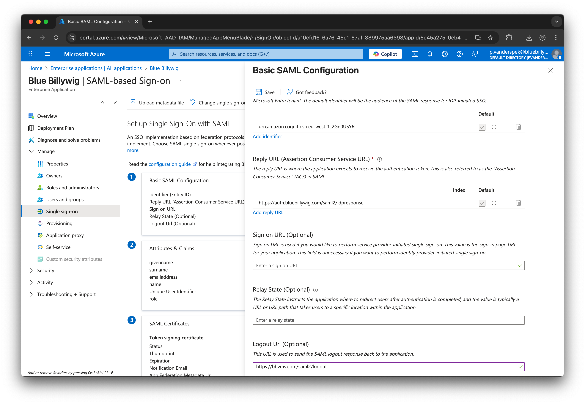

### Attributes & Claims

* Click **Edit** in the **Attributes & Claims** section.

* The required and additional claims should include:

  | Claim name | Value |
  |:-----------|:------|
  | **Unique User Identifier (Name ID)** | `user.userprincipalname` |
  | `http://schemas.xmlsoap.org/ws/2005/05/identity/claims/emailaddress` | `user.mail` |
  | `http://schemas.xmlsoap.org/ws/2005/05/identity/claims/givenname` | `user.givenname` |
  | `http://schemas.xmlsoap.org/ws/2005/05/identity/claims/name` | `user.userprincipalname` |
  | `http://schemas.xmlsoap.org/ws/2005/05/identity/claims/surname` | `user.surname` |

  These are the defaults and can be left to their default values.

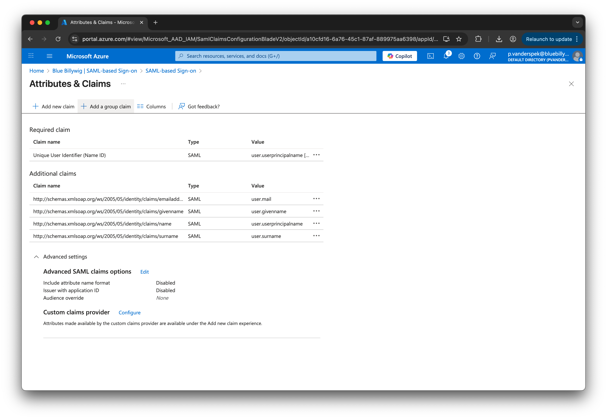

#### Group Claims

* Click **Add a group claim**.
* Select **Security groups** (or the appropriate group type for your organization).
* Set **Source attribute** to **Group ID**.

* Click **Advanced options**.
* Check **Customize the name of the group claim**.
* Check **Emit groups as role claims**.
* Click **Save**.

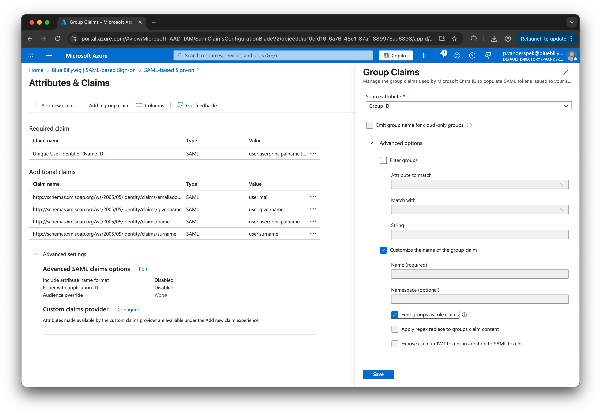

### SAML Configuration Complete

Once the configuration is complete, you will see the overview with all configured settings:

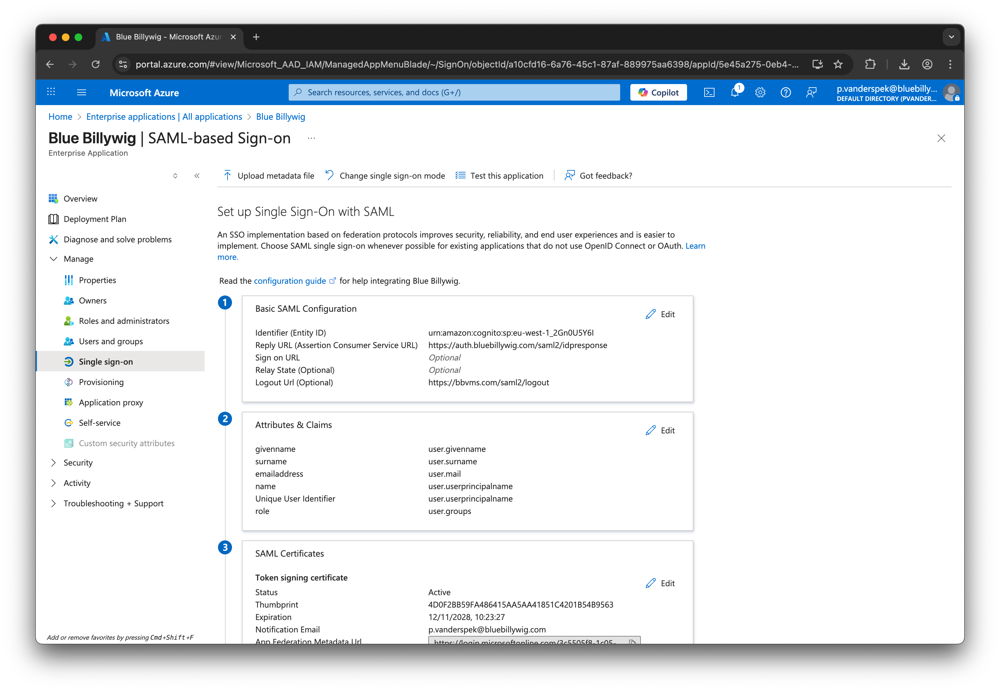

### SAML Certificates and Metadata

* In the **SAML Certificates** section, note the **App Federation Metadata Url**. You will need this URL later.

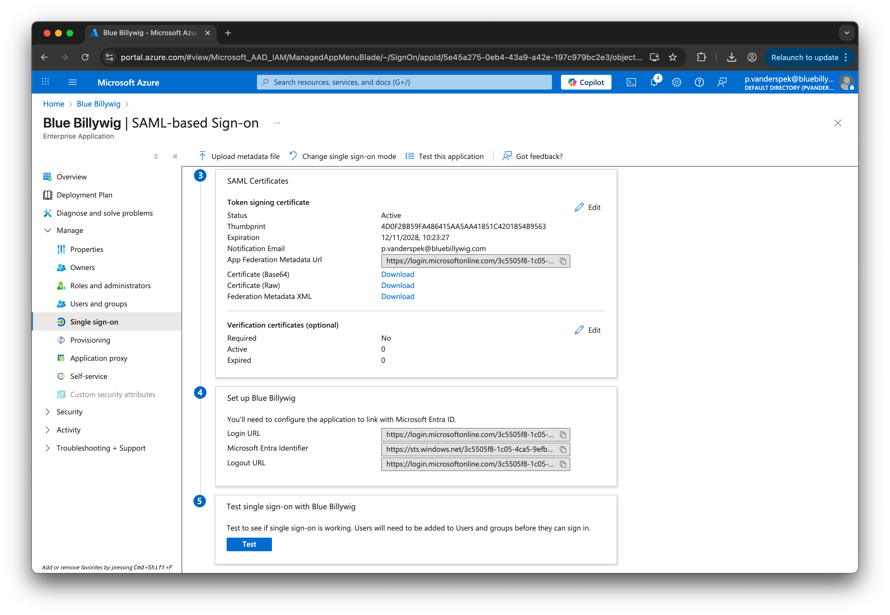

## User Assignment

In order for users to be able to log in to the Blue Billywig OVP using Entra ID SSO, users must be in one or more groups
that are allowed to connect using the SSO app. The method of allowing users to use the application is up to the Entra ID
administrator. 

When multiple publications in the Blue Billywig OVP are used, and/or more than one role is used, it is advisable to 
create separate groups in Entra ID for this purpose. These groups can then be mapped to publications and roles in the
Blue Billywig OVP.

## Finalizing the integration in Blue Billywig OVP

To finalize the SSO integration, communicate the following information to your Blue Billywig account manager:

* The **App Federation Metadata Url** (see [the section above](#saml-certificates-and-metadata) to get this URL).
* The IDs of the security groups that will be exposed (if using group-based authorization).

> [!NOTE]
> 
> When Entra ID is only used for authentication, but authorization is done from within Blue Billywig OVP, there is no
> need to provide the group IDs.
> 
> When Entra ID is used for both authentication and authorization and/or is used for accessing multiple publications in
> Blue Billywig OVP, the group IDs must be communicated, along with how they should map to which publication and with
> what roles. Your account manager can help with setting that up.
> 
> The group ID can be retrieved from Entra ID by navigating to **Default Directory** -> **Groups**, selecting the group,
> and copying the **Object ID** from the group's overview page.
