<picture>
  <source media="(prefers-color-scheme: dark)" srcset="img/logo_grey.png">
  <source media="(prefers-color-scheme: light)" srcset="img/logo_blue.png">
  
</picture>

# Setting up SSO with Okta

When you're using [Okta](https://okta.com) as an Identity Provider, the following steps must be followed to connect the
Blue Billywig SSO to Okta.

## Create new application

* Log in into the Okta Admin Console and click on **Applications** -> **Applications** in the menu.

  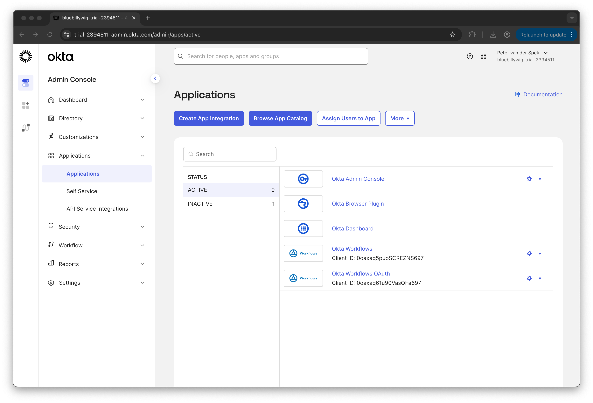

* Click on **Create App Integration**.
* Select **SAML 2.0**
* Click **Next**.

  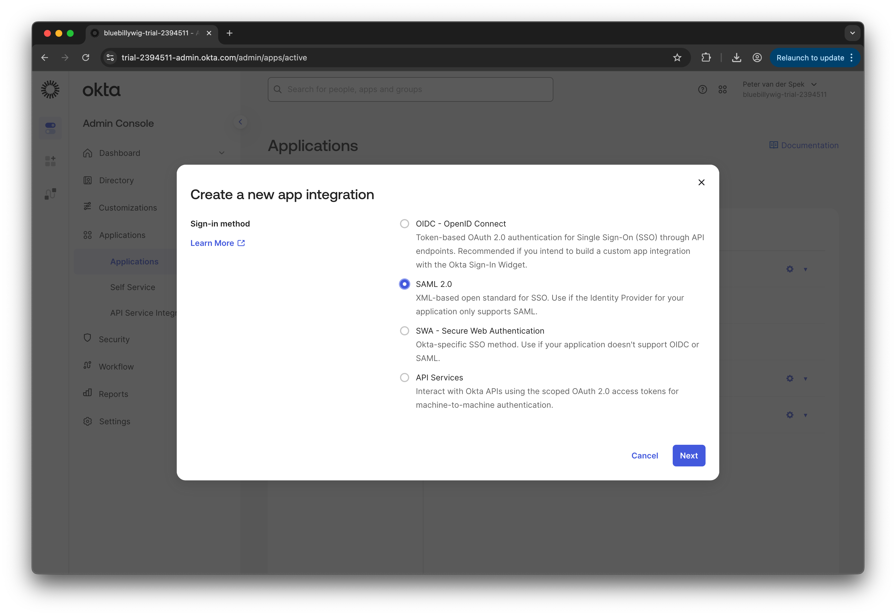

### Create new application - General settings

* In **Create SAML Integration** -> **General Settings**:
* Enter the **App name**, for example: `Blue Billywig`.
* Optionally, upload an **App logo**. The Blue Billywig logo can be [downloaded from here](img/logo_blue.png).
* Leave **App visibility: Do not display application icon to users** unchecked.
* Click **Next**.

  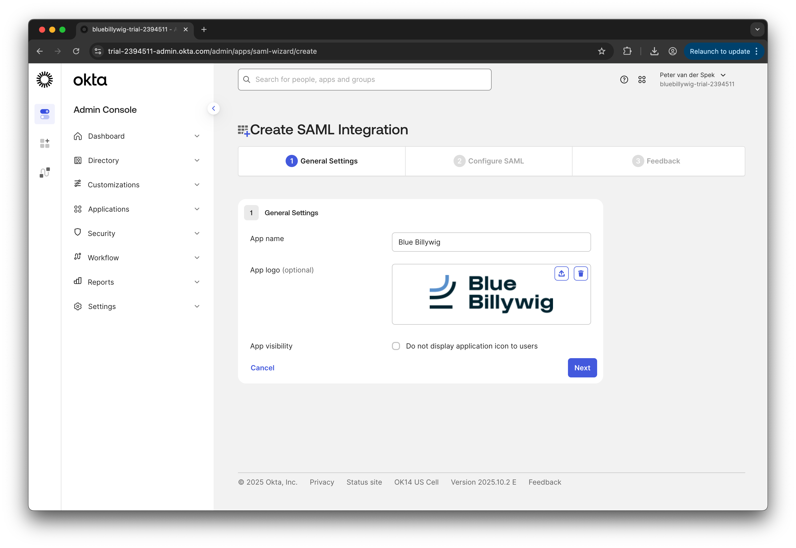

### Create new application - SAML settings

* In **Create SAML Integration** -> **Configure SAML**:
* Enter **Single sign-on URL**: `https://auth.bluebillywig.com/saml2/idpresponse`
* Enter **Audience URI (SP Entity ID)**: `urn:amazon:cognito:sp:eu-west-1_2Gn0U5Y6I`

  > [!NOTE]
  > The above **Single sign-on URL** and **Audience URI (SP Entity ID)** are for connecting to the Blue Billywig 
  > production environment. When you need to connect to the Blue Billywig test environment, use the following settings
  > instead:
  > 
  > * **Single sign-on URL**: `https://test.auth.bluebillywig.com/saml2/idresponse`
  > * **Audience URI (SP Entity ID)**: `urn:amazon:cognito:sp:eu-west-1_nPGHGV8P3`

* Leave **Default RelayState** empty.
* Set **Name ID format** to `EmailAddress`.
* Leave **Application username** set to `Okta username`.
* Leave **Update application username on** set to `Create and update`.
  
  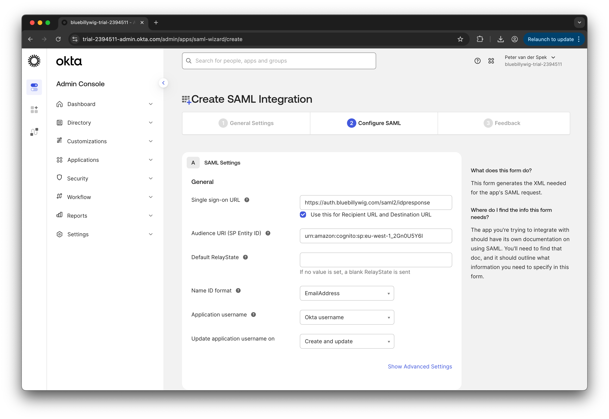

* Click **Show Advanced Settings**.
* Leave **Response** set to `Signed`.
* Leave **Assertion Signature** set to `Signed`.
* Leave **Signature Algorithm** set to `RSA-SHA256`.
* Leave **Digest Algorithm** set to `SHA256`.
* Leave **Assertion Encryption** set to `Unencrypted`.
* Upload the **Signature Certificate**: [auth.bluebillywig.com.crt](crt/auth.bluebillywig.com.crt).

  > [!NOTE]
  > When you need to connect to the Blue Billywig test environment, use this signature certificate instead:
  > [test.auth.bluebillywig.com.crt](crt/test.auth.bluebillywig.com.crt).

* Check **Enable Single Logout: Allow application to initiate Single Logout**.
* Set **Single Logout URL** to: `https://auth.bluebillywig.com/saml2/logout`.
* Set **SP Issuer** to: `urn:amazon:cognito:sp:eu-west-1_2Gn0U5Y6I`.

  > [!NOTE]
  > When you need to connect to the Blue Billywig test environment, use these settings instead:
  > 
  > * **Single Logout URL**: `https://test.auth.bluebillywig.com/saml2/logout`.
  > * **SP Issuer**: `urn:amazon:cognito:sp:eu-west-1_nPGHGV8P3`.

  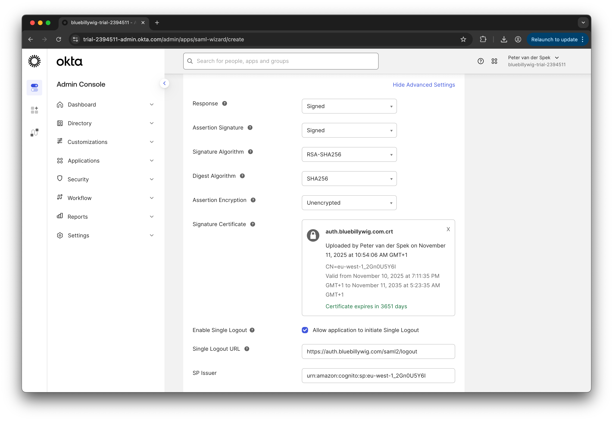

* Leave **Signed Requests** unchecked.
* Leave **Other Requestable SSO URLs** empty.
* Leave **Assertion Inline Hook** set to `None (disabled)`.
* Leave **Authentication context class** set to `PasswordProtectedTransport`.
* Leave **Honor Force Authentication** set to `Yes`.
* Leave **SAML Issuer ID** set to `http://www.okta.com/${org.externalKey}`.
* Leave **Maximum app session lifetime: Send value in response** unchecked.

  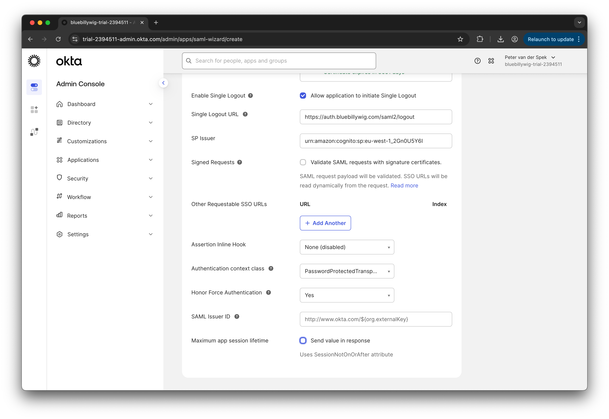

### Create new application - Attribute Statements

* The following attribute statements and group attribute statements should be added here. 
  > [!CAUTION]
  > 
  > When the **Unified claims generation for Okta-protected SAML and OIDC custom app integrations** feature is enabled
  > in **Settings** -> **Features**, attribute statements cannot be added here, but are instead added later in the
  > [Sign-on settings](#attribute-statements).
  >
  > For more information about this feature, see the relevant 
  > [Okta documentation](https://help.okta.com/oie/en-us/content/topics/apps/federated-claims-overview.htm). 
  >
  > When the feature is enabled, please [skip this section](#create-new-application---preview-saml-settings). 

* In **Attribute Statements (optional)** add:

  | Name                                | Name format     | Value                    |
  |:------------------------------------|:----------------|:-------------------------|
  | `urn:oid:2.5.4.42`                  | `URI Reference` | `user.profile.firstName` |
  | `urn:oid:2.5.4.4`                   | `URI Reference` | `user.profile.lastName`  |
  | `urn:oid:2.5.4.3`                   | `URI Reference` | `user.profile.login`     |
  | `urn:oid:0.9.2342.19200300.100.1.3` | `URI Reference` | `user.profile.email`     |

* In **Group Attribute Statements (optional)** add:

  | Name                               | Name format     | Filter             |
  |:-----------------------------------|:----------------|:-------------------|
  | `urn:oid:1.3.6.1.4.1.5923.1.1.1.1` | `URI Reference` | *Filter of choice* |

  > [#NOTE]
  > 
  > You can filter the groups that are exposed here. A filter is required. Setting the filter type to `Matches regex`
  > and the filter value to `.*` will expose all groups the user is member of.

  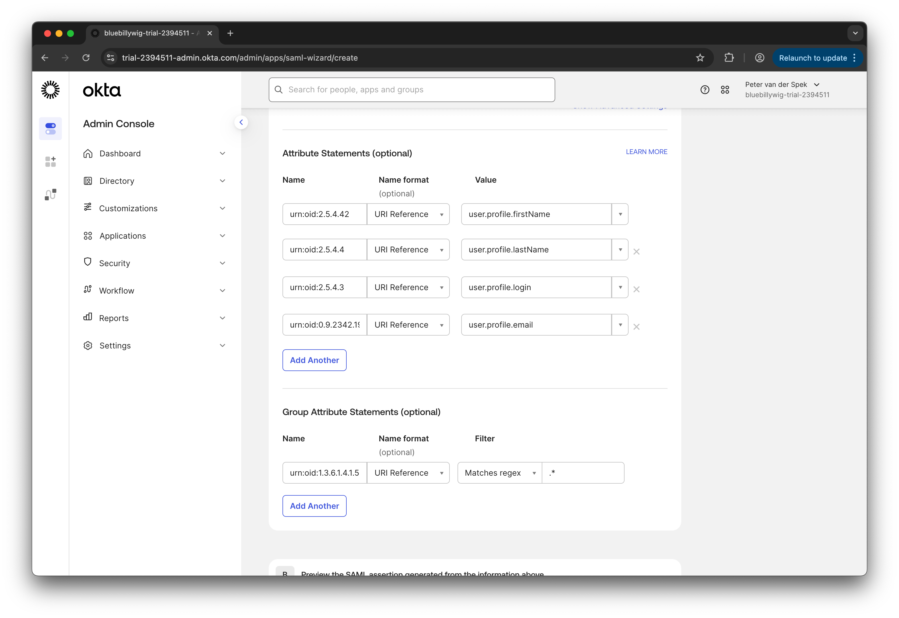

### Create new application - Preview SAML settings

* You may optionally check the SAML settings entered above by clicking **Preview the SAML Assertion**.
* Click **Next**.

  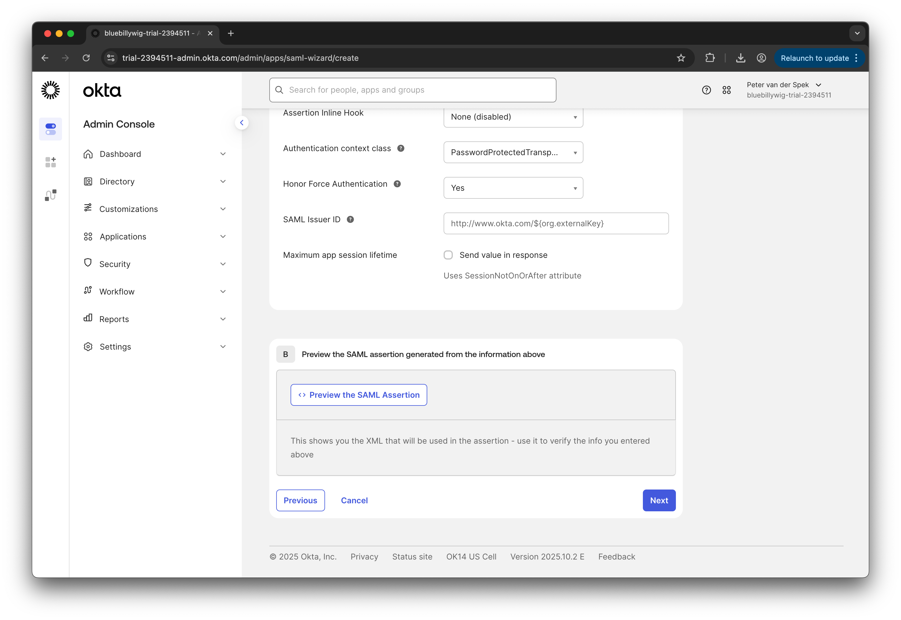

### Create new application - Help Okta Support

* You may skip this steps and click **Finish**.

  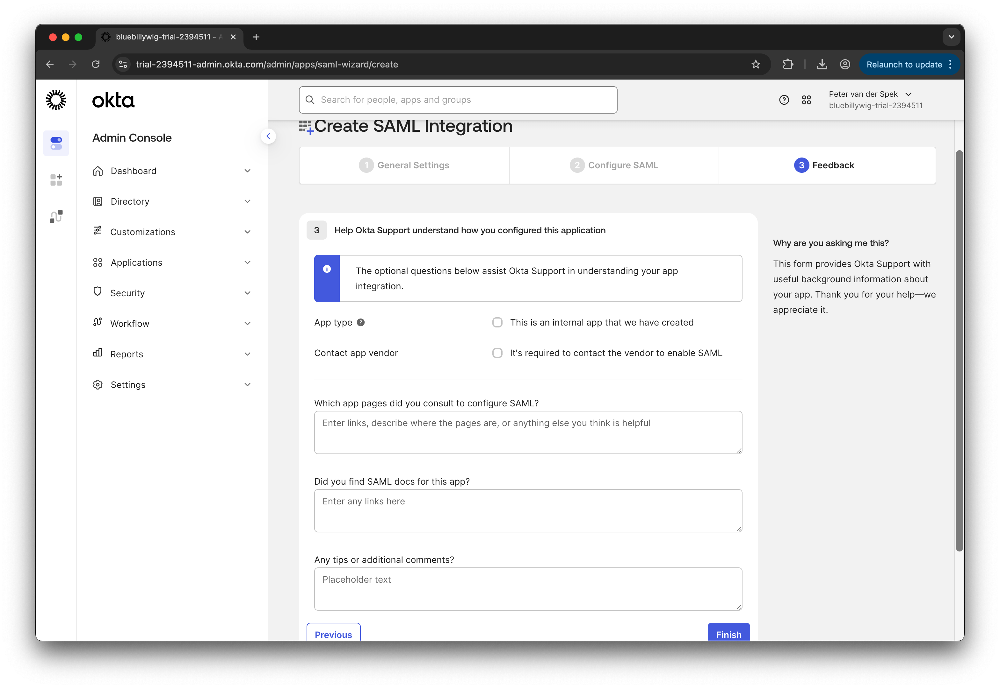

The new application has now been created in Okta.

## Sign-On settings

* In the application **Sign On** tab, look up the **SAML 2.0 Metadata URL**. You will need this URL later.

  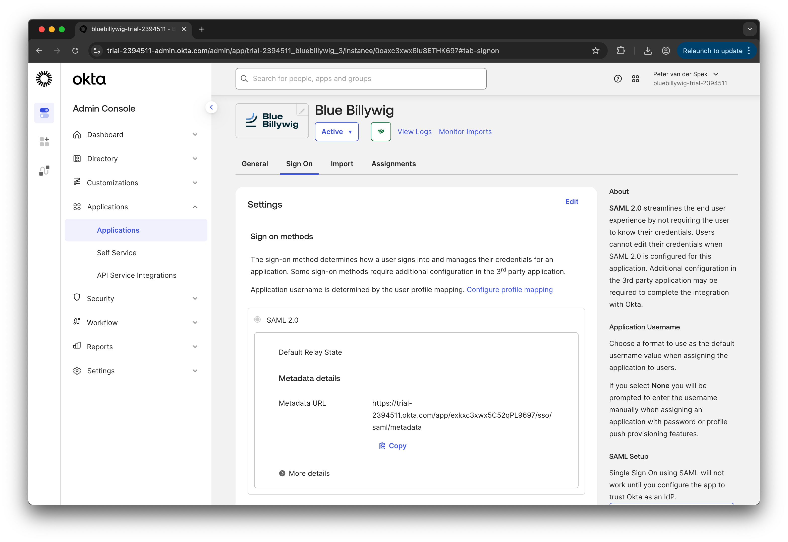

### Attribute statements

* Scroll down to the **Attribute statements** section.

  > [#CAUTION]
  >
  > The attribute statements can only be configured here when the **Unified claims generation for Okta-protected SAML
  > and OIDC custom app integrations** feature is enabled in **Settings** -> **Features**.
  >
  > When the feature is not enable, please [skip this section](#assignments). 

* Click **Add expression**.
* Add the following attribute statements:
    
  | Name                                | Expression                                             |
  |:------------------------------------|:-------------------------------------------------------|
  | `urn:oid:2.5.4.42`                  | `user.profile.firstName`                               |
  | `urn:oid:2.5.4.4`                   | `user.profile.lastName`                                |
  | `urn:oid:2.5.4.3`                   | `user.profile.login`                                   |
  | `urn:oid:1.3.6.1.4.1.5923.1.1.1.1`  | `user.getGroups({'group.type': {'OKTA_GROUP'}}).![id]` |
  | `urn:oid:0.9.2342.19200300.100.1.3` | `user.profile.email`                                   |

  

## Assignments

In order for users to be able to log in into the Blue Billywig OVP using Okto SSO, the users must be assigned to the
just created app. The most straightforward way to do this is to assign users to a group and assign that group to this
app.

How users are assigned to the just created app is up to the Okto administrator. When multiple publications in the Blue
Billywig OVP are used, and/or more than one role is used, it is advisable to create separate groups in Okto for this.
The groups can then be mapped to publications and roles in the Blue Billywig OVP.

## Finalizing the integration in Blue Billywig OVP

To finalize the SSO integration, communicate the following information to your Blue Billywig account manager:

* The SAML 2.0 metadata URL (see [the section above](#sign-on-settings) to get this URL).
* The IDs of the groups that will be exposed.

  > [#NOTE]
  > 
  > When Okto is only used for authentication, but authorization is done from within Blue Billywig OVP, there is no
  > need to give the group IDs.
  > 
  > When Okto is used for both authentication and authorization and/or is used for accessing multiple publications in
  > Blue Billywig OVP, the group IDs must be communicated, along with how the should map to which publication and with
  > what roles. You account manager can help with setting that up.
  > 
  > The group ID can be retrieved from Okto by navigating to the group page and looking it up in the group page URL. In 
  > the example below the group ID is: `00gxchai4vHYpSKlR697`: 
  > 
  > 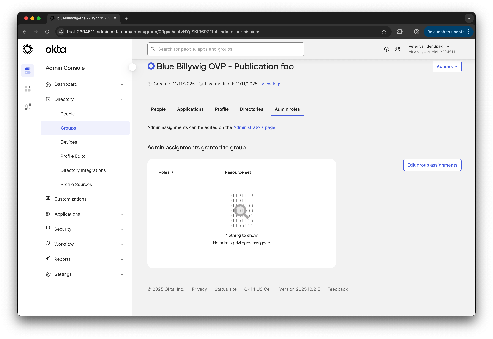
